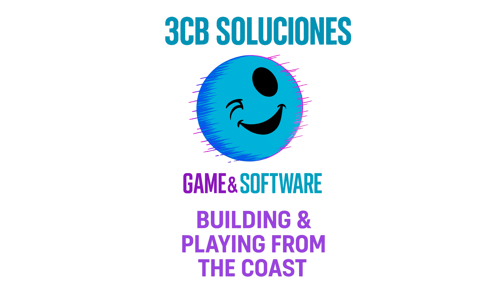

# 🤖 Chatbot Interactivo
- **Un chatbot simple y funcional, diseñado para fines educativos y adaptado para ser la solución perfecta para tu negocio. Utiliza un backend y un frontend moderno con HTML, CSS y JavaScript.**

# Características Principales
- **Backend con Flask:** Servidor ligero y eficiente para manejar la lógica del chatbot.

- **Frontend Amigable:** Interfaz moderna y responsiva construida con HTML, CSS y JavaScript, con el soporte de Bootstrap.

- **Lógica de Coincidencias:** Responde de manera inteligente analizando la similitud de las preguntas del usuario con su base de datos.

- **Fácil de Personalizar:** Permite a los usuarios añadir nuevas respuestas y modificar el diseño sin necesidad de conocimientos avanzados.

- **Respuestas Inteligentes:** Configura el bot para que responda a las preguntas más frecuentes de tus clientes, resolviendo dudas de forma automática.

- **Base de Conocimiento Adaptable:** Usa un simple archivo .csv para almacenar tus preguntas y respuestas. ¡Es tan fácil como editar una hoja de Excel!

- **Integración Sencilla:** Diseñado para ser integrado fácilmente en cualquier sitio web existente.

- **Diseño Profesional:** Interfaz limpia y responsiva que se adapta a cualquier dispositivo, ofreciendo una experiencia de usuario fluida.

- **Personalización Total:** Modifica el código para que el chatbot se ajuste a la voz y la identidad de tu marca, desde la apariencia hasta la forma de responder.

# 📁 Estructura del Proyecto
**La organización del código está pensada para ser intuitiva y fácil de navegar:**

<!-- - chatbot-claseia/
- ├── backend/
- │   ├── app.py                      # 🧠 Lógica principal del servidor Flask
- │   └── knowledge_base/
- │       └── response.csv            # 📚 Base de datos de preguntas y respuestas
- ├── frontend/
- │   ├── static/
- │   │   ├── css/
- │   │   │   └── styles.css          # 🎨 Estilos del chatbot
- │   │   └── js/
- │   │       └── script.js           # ⚙️ Lógica interactiva del frontend
- │   └── templates/
- │       └── chat.html               # 🖥️ Estructura visual de la interfaz
- ├── README.md                       # 📝 Este documento
- └── requirements.txt                # 📦 Dependencias del proyecto -->
      
      chatbot-claseia/
      ├── backend/
      │   ├── app.py                      # 🧠 Lógica principal del servidor Flask
      │   └── knowledge_base/
      │       └── response.csv            # 📚 Base de datos de preguntas y respuestas
      ├── frontend/
      │   ├── static/
      │   │   ├── css/
      │   │   │   └── styles.css          # 🎨 Estilos del chatbot
      │   │   └── js/
      │   │       └── script.js           # ⚙️ Lógica interactiva del frontend
      │   └── templates/
      │       └── chat.html               # 🖥️ Estructura visual de la interfaz
      ├── README.md                       # 📝 Este documento
      └── requirements.txt                # 📦 Dependencias del proyecto

- [][][][][][][][][][][][][][][][][][][][]***3CB SOLUCIONES***[][][][][][][][][][][][][][][][][][][][][][][][][][][]
## **Guía de Instalación y Uso**

- **Soporte al Cliente Básico:** Responde a preguntas comunes sobre tus productos o servicios 24/7.

- **Generación de Leads:** Captura información de contacto de los visitantes de tu sitio web.

- **Educación y Onboarding:** Guía a nuevos usuarios a través de tus procesos o funcionalidades.
- [][][][][][][][][][][][][][][][][][][][][][][]**3CB SOLUCIONES**[][][][][][][][][][][][][][][][][][][][][][][][][][][][]
### **Sigue estos pasos para descargar, configurar y ejecutar el chatbot en tu máquina.**

- **Paso 1:** Requisitos Previos
- **Asegúrate de tener instalado Python 3.8 o superior. Para verificarlo, abre tu terminal y ejecuta:**
  ```bash
   python --version

- **Paso 2:** Descargar el Código
- **Clona este repositorio desde GitHub usando git:**
    ```bash
     git clone https://github.com/tu-usuario/chatbot-claseia.git
     cd chatbot-claseia

- **Paso 3: Instalar Dependencias**
- **Navega a la carpeta del backend e instala las bibliotecas necesarias.**
   ```bash
     cd backend
     pip install -r requirements.txt

- **Nota: He añadido el archivo requirements.txt a la estructura para simplificar la instalación. Si no lo tienes, puedes crearlo y pegar el siguiente contenido:**
   ```bash
   Flask
   pandas

# **Paso 4: Ejecutar el Chatbot**
- **Desde la carpeta backend, ejecuta el servidor Flask.**
  ```bash
   python app.py

- **Verás un mensaje en la terminal que indica que el servidor se está ejecutando en una dirección local.**

# **Paso 5: Interactuar con el Chatbot**
- **Abre tu navegador web y visita la siguiente dirección para acceder a la interfaz:**
   ```bash
   http://127.0.0.1:5000

**¡Ahora ya puedes empezar a chatear con tu bot!**
